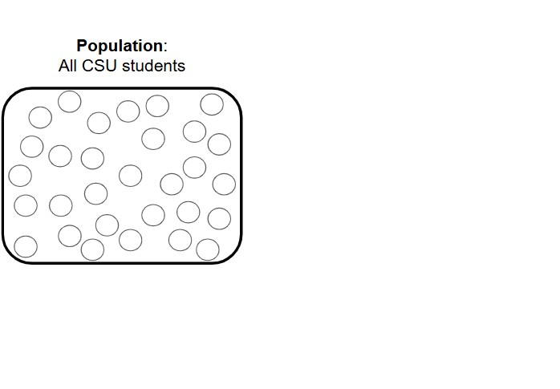
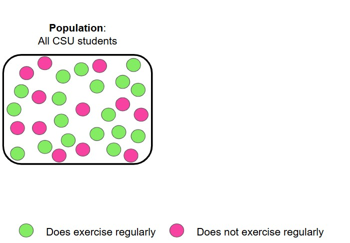
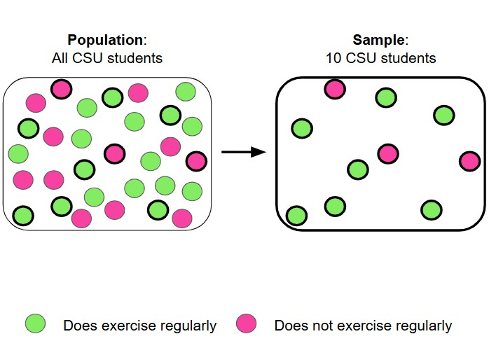
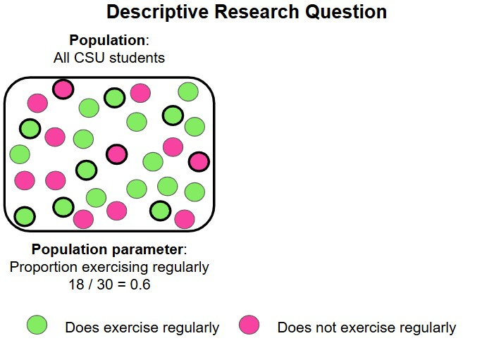
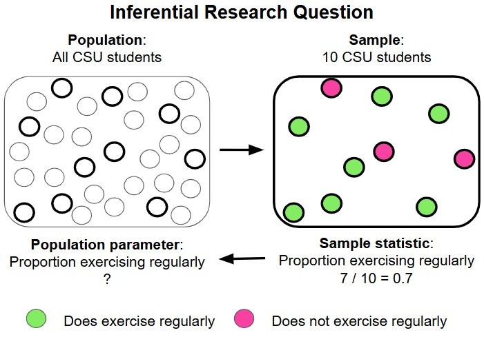
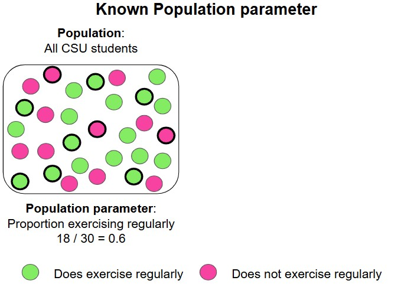
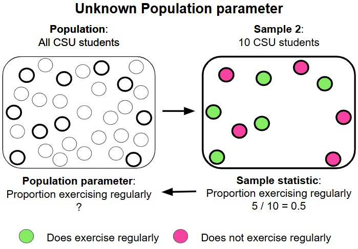
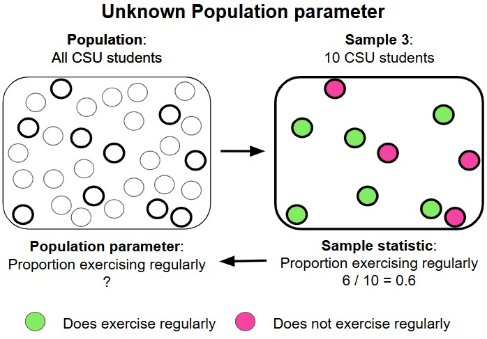
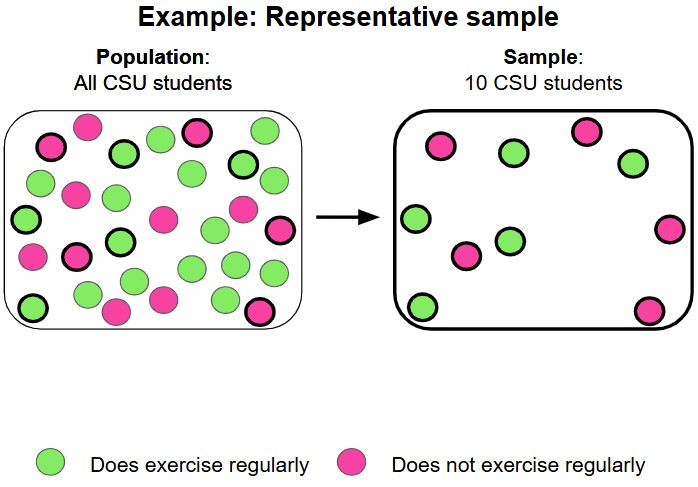
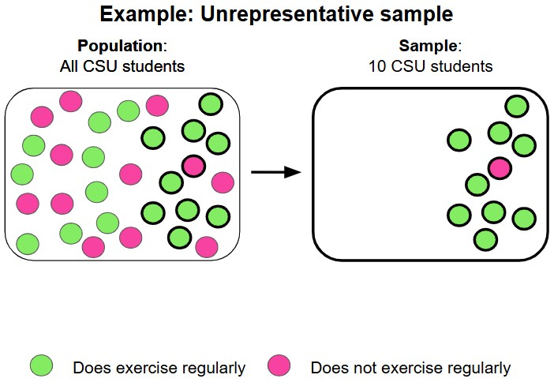

```{r}
#| echo: false
options(scipen = 999)
library(broom)
library(modelr)
library(janitor)
library(rsample)
library(tidyverse)
theme_set(theme_bw(base_size = 22))
```


```{r}
#| echo: false
plot_beta_prob <- function(value, alpha, beta, direction = "lower"){
  
  data <- data.frame(x = c(0, 1))
  
  p <- ggplot(data = data, aes(x)) +
    stat_function(
      fun = stats::dbeta,
      n = 101,
      args = list(shape1 = alpha, shape2= beta)
    ) +
    labs(
      x = expression(pi),
      y = "Density"
    )
  
  if(direction == "lower"){
    
  p <- p +
      stat_function(
        fun = dbeta, 
        args = list(alpha, beta), 
        geom = "area", 
        fill = "#D55E00", 
        alpha = 0.8,
        xlim = c(0, value)
      ) +
    labs(caption = paste0(
      "The area under the curve is ", 
      round(pbeta(value, alpha, beta), digits = 4)*100, "%.", 
      " In other words, P(", "\U03C0", " < ", value, ") = ", 
      round(pbeta(value, alpha, beta), digits = 4),"."
    ))
  }
  
  
  if(direction == "upper"){
    
  p <- p +
      stat_function(
        fun = dbeta, 
        args = list(alpha, beta), 
        geom = "area", 
        fill = "#D55E00", 
        alpha = 0.8, 
        xlim = c(value, 1)
      ) +
    labs(caption = paste0(
      "The area under the curve is ", 
      round(pbeta(value, alpha, beta, lower.tail = FALSE), digits = 4)*100, "%.", 
      " In other words, P(", "\U03C0", " > ", value, ") = ", 
      round(pbeta(value, alpha, beta, lower.tail = FALSE), digits = 4),"."
    ))
  }
  
p

}


plot_normal_prob <- function(value, mean, sd, end = 3, direction = "lower"){
  
  x <- seq(mean - (end * sd) , mean + (end * sd), 0.01)
  
  y <- dnorm(x, mean = mean, sd = sd)
  
  data <- data.frame(x = x, y = y)
  
  p <- ggplot(data = data, aes(x)) +
    stat_function(
      fun = stats::dnorm,
      n = 101,
      args = list(mean = mean, sd= sd)
    ) 
  
  if(direction == "lower"){
    
    p <- p +
      stat_function(
        fun = dnorm, 
        args = list(mean, sd), 
        geom = "area", 
        fill = "#D55E00", 
        alpha = 0.8,
        xlim = c(mean - (end*sd), value)
      ) +
      labs(
        caption = paste0(
          "The area under the curve is ",
          round(pnorm(value, mean, sd), digits = 4) * 100, 
          "%."
        )
      )
  }
  
  
  if(direction == "upper"){
    
    p <- p +
      stat_function(
        fun = dnorm, 
        args = list(mean, sd), 
        geom = "area", 
        fill = "#D55E00", 
        alpha = 0.8, 
        xlim = c(value, mean+(end * sd))
      ) +
      labs(
        caption = paste0(
          "The area under the curve is ", 
          round(pnorm(value, mean, sd, lower.tail = FALSE), digits = 4) * 100, 
          "%."
        )
      )
  }
  
  p
  
}
```


## Research questions

Every research project aims to answer a research question (or multiple questions).

::: {.callout-tip icon=false}
## Example
RQ: What proportion of CSUCI students exercise regularly?
::: 


## Population

The **population** for a research question is who/what we want to learn about.

::: {.callout-tip icon=false}
## Example

RQ: What proportion of **CSUCI students** exercise regularly?

Population: all CSUCI students

:::

## Sample

We typically do not have data on everyone in the population we want to learn about.

A **sample** is a subset of the population that you have data for

::: {.callout-tip icon=false}
## Example

RQ: What proportion of **CSUCI students** exercise regularly?

Population: all CSUCI students

Data: sample of 10 CSUCI students

:::

##

{fig-width=100%}

## 

{fig-width=100%}

## 

{fig-width=100%}


## Descriptive research question

If we had data on everyone in our population, then we can directly compute the quantity of interest, the **population parameter**

. . .

::: {.callout-tip icon=false}
## Example

RQ: What proportion of CSUCI students exercise regularly?

Population: all CSUCI students

Data: all CSUCI students

Population parameter: proportion of CSUCI students that exercise regularly

:::

## Inferential research question

If we can only get data for a subset of our population, a **sample**, then we can compute a **sample statistic**

We use the sample statistic to infer about the population parameter!

. . .


::: {.callout-tip icon=false}
## Example

RQ: What proportion of CSUCI students exercise regularly?

Population: all CSUCI students

Data: sample of 10 CSUCI students

Sample statistic: proportion of CSUCI students that do exercise regularly **in our sample**

:::


## 

{fig-width=100%}

## 

{fig-width=100%}

## The field of inferential statistics

The sample statistic is not a perfect estimate for the population parameter, it can vary from sample to sample

. . .

::: {.callout-tip icon=false}
## Example

RQ: What proportion of CSUCI students exercise regularly?

Population: all CSUCI students

Data: sample of 10 CSUCI students

Sample statistic: 0.7

Population parameter: 0.6

:::

## 

{fig-width=100%}

## 

{fig-width=100%}

## 

{fig-width=100%}

## 

{fig-width=100%}

##  The field of inferential statistics

The sample statistic is not a perfect estimate for the population parameter, it can vary from sample to sample

Statisticians have developed methods for inferring a population parameter with a measure of uncertainty

. . .

::: {.callout-tip icon=false}
## Example

RQ: What proportion of CSUCI students exercise regularly?

Inference: We estimate the proportion of CSUCI students that exercise regularly to be [*sample statistic*] plus or minus [*some margin of error*].

:::

. . .

Over the next couple of weeks we will be learning how to get a margin of error!

## Representative sample

Ideally, we want our sample to be representative of our population of interest, so we can have a better estimate for the population parameter

- To achieve this we want a **simple random sample** from our population, meaning everyone in the population had an equal chance of being in our sample

## 

{fig-width=100%}

## 

{fig-width=100%}

