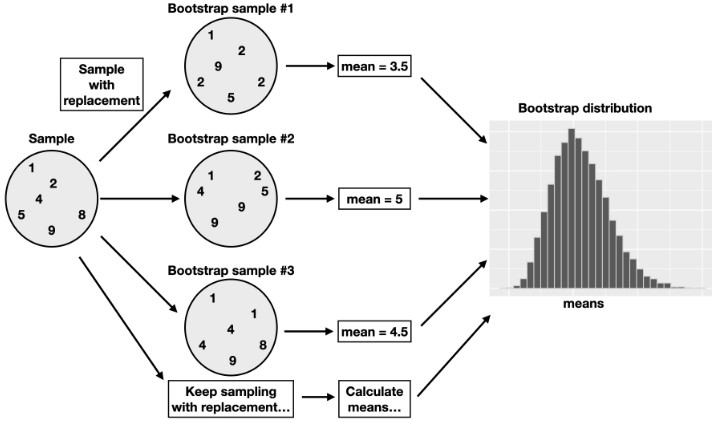
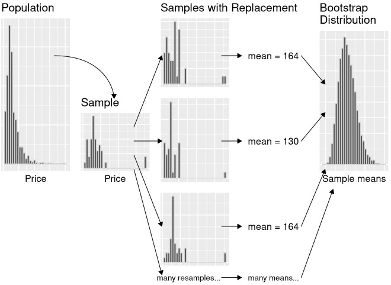

```{r}
#| echo: false
options(scipen = 999)
library(janitor)
library(patchwork)
library(tidyverse)
theme_set(theme_bw(base_size = 22))
```

##

Last class our population of interest was all full time workers at the LAPD in 2018.

- We actually had data for everyone in the population, so we were able to get the sampling distribution for a sample statistic.
- Typically we don't data for entire population, ... **so how do we know how much our sample statistics will vary from the population parameter?**

. . .

**We will use bootstrapping!**


# Review sampling distribution for mean salary ($n=100$)

## Study components

**Research question**: How much did full time workers in the LAPD in 2018 make, on average?

**Population of interest**: people working full time for the LAPD in 2018

**Population parameter**: mean salary of people working full time for the LAPD in 2018

## Prep data

```{r}
#| echo: true

library(infer)

set.seed(20260420)

lapd <- read_csv("https://csuci-data200-spring2026.github.io/lectures/data/Police_Payroll.csv") |> 
  clean_names() |> 
  filter(year == 2018 & employment_type == "Full Time") |> 
  select(projected_annual_salary, job_class_title) |> 
  mutate(over_100k = case_when(
    projected_annual_salary > 100000 ~ TRUE,
    projected_annual_salary <= 100000 ~ FALSE
  ))
```

## Get sampling distribution ($n=100$)

```{r}
lapd_samples <- rep_sample_n(lapd, size = 100, reps = 20000) |> 
  group_by(replicate) |> 
  summarize(salary_sample_means = mean(projected_annual_salary))

ggplot(lapd_samples, aes(x = salary_sample_means)) +
  geom_histogram() +
  geom_vline(xintercept = 103127.27, color = "red")
```

. . .

*Not typically known in real life!*

# Single sample

- Image we only have a single sample of 100 people from the original lapd data.
- We will use the single sample to approximate the sampling distribution

## Bootstrapping

If we have a sample of size $n$ that is representative of the population of interest we can **act like the single sample is the population** and simulate samples to approximate the sampling distribution 

- Our samples will be of the same size $n$ and sampled with replacement.
- The approximate sampling distribution is called the **bootstrap distribution**

## 

```{r}
#| echo: false
#| fig-align: "center" 
#| fig-cap: "Data Science: A First Introduction Figure 10.9: Overview of boostrapping process."


```

## Example: Boostrapping for mean salary 

We will start by imaging we only had a sample of 100 lapd full time workers from 2018

```{r}
observed_lapd <- slice_sample(lapd, n = 100)

glimpse(observed_lapd)
```


## Theoretical steps of boostrapping

1. Randomly sample $n$ rows from your data *with replacement*
2. Calculate the sample statistic (e.g., proportion, mean, etc)
3. Repeat steps 1 and 2 many times, combining all sample statistics to get the approximate sampling distribution (bootstrap distribution)

## Boostraping in R

```{r}
lapd_bootstrap_sample_means <- rep_sample_n(
  observed_lapd, 
  size = 100,
  rep = 20000,
  replace = TRUE
) |> 
  group_by(replicate) |> 
  summarize(mean_salary = mean(projected_annual_salary))

head(lapd_bootstrap_sample_means)
```

## Boostrap distribution

```{r}
ggplot(lapd_bootstrap_sample_means, aes(x = mean_salary)) +
  geom_histogram()
```

## Comparing true and approximate sampling distributions

```{r}
#| echo: false
gridExtra::grid.arrange(
  ggplot(lapd_samples, aes(x = salary_sample_means)) +
    geom_histogram() +
    geom_vline(xintercept = 103127.27, color = "red") +
    labs(title = "Sampling distribution"),
  ggplot(lapd_bootstrap_sample_means, aes(x = mean_salary)) +
    geom_histogram() +
    geom_vline(xintercept = 103127.27, color = "red") +
    labs(title = "Bootstrap distribution"),
  nrow = 1
)
```

# Confidence intervals

Okay, so now we know we can approximate the sampling distribution, but what do we do with it?

A **confidence interval** is a range of plausible values for the population parameter

- We can a 95% confidence interval by finding the two values that separate the middle 95% of our approximate / bootstrap sampling distribution

## Middle 95% of bootstrap distribution

```{r}
quantile(lapd_bootstrap_sample_means$mean_salary, probs = c(0.025, 0.975))
```

```{r}
#| echo: false

ci <- round(
  quantile(lapd_bootstrap_sample_means$mean_salary, probs = c(0.025, 0.975)),
  2
)

ggplot(lapd_bootstrap_sample_means, aes(x = mean_salary)) +
  geom_histogram() +
  geom_vline(xintercept = 103127.27, color = "red") +
  geom_vline(xintercept = ci, color = "blue", linetype = "dashed") +
  labs(title = "Bootstrap distribution")
```

## Interpreting confidence interval

With our single sample of 100 LAPD workers:
```{r}
mean(observed_lapd$projected_annual_salary)
```

We estimate the true mean salary for all LAPD full time workers in 2018 to be $`r mean(observed_lapd$projected_annual_salary)`.


```{r}
quantile(lapd_bootstrap_sample_means$mean_salary, probs = c(0.025, 0.975))
```

We are 95% confident that the true mean salary for all LAPD full time workers in 2018 is between $`r ci[1]` and $`r ci[2]`.

# Summary of bootstrap process

##

```{r}
#| echo: false
#| fig-align: "center" 
#| fig-cap: "Data Science: A First Introduction Figure 10.15: Sumary of boostrapping process."


```


```{r}
#| echo: false
#| eval: false

observed_lapd

lapd_bootstrap_sample_props <- rep_sample_n(
  observed_lapd, 
  size = 100,
  rep = 20000,
  replace = TRUE
) |> 
  group_by(replicate) |> 
  summarize(prop_over_100k = sum(over_100k == TRUE) / 100)

summarize(observed_lapd, prop_over_100k = sum(over_100k == TRUE) / 100)
quantile(lapd_bootstrap_sample_props$prop_over_100k, probs = c(0.025, 0.975))
```

